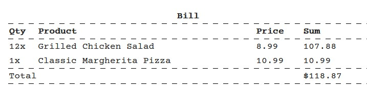

# Project Journal - 2023-12-27

Today, I dedicated a significant amount of time to a seemingly straightforward task - fetching orders with pagination. Using several sources, I have created a solid query (it seems to me) for this purpose.

Here's the Dapper query:

```sql
WITH OrderedOrders AS (
    SELECT
        o.Id AS OrderId,
        o.OrderTime,
        o.IsCancelled,
        ROW_NUMBER() OVER (ORDER BY o.OrderTime DESC) AS RowNum
    FROM dbo.Orders o
    JOIN dbo.OrderIds oid ON oid.OrderId = o.Id
    WHERE oid.RestaurantId = @restaurantId
)
SELECT
    oo.OrderId,
    oo.OrderTime,
    oo.IsCancelled,
    (
        SELECT
            oi.MenuItemId,
            oi.Quantity,
            mi.Name AS MenuItemName,
            mi.Price
        FROM dbo.OrderItem oi
        JOIN dbo.MenuItems mi ON mi.MenuItemId = oi.MenuItemId
        WHERE oi.OrderId = oo.OrderId
        FOR JSON PATH
    ) AS OrderItems
FROM OrderedOrders oo
WHERE oo.RowNum >= @startRow AND oo.RowNum < @endRow
ORDER BY oo.RowNum;
```

By initially limiting the scope to a single restaurant, the data retrieval process should be quick. Using JSON for nested data may raise some eyebrows, but surprisingly it's not a bad idea. The maximum value in the pagination is 20 items, so the overhead associated with serialisation and deserialisation will have a minimal impact on performance. When retrieving data for statistics (at least that's the plan for regional managers to view order-related statistics), I'll use a different query that's better suited to a background worker (considering Hangfire).

Getting back to the main topic of this journal entry, the most time consuming aspect was dealing with the Angular Material table... I loathe this component with all my heart. While other Angular Material components are well-designed, there hasn't been a day without problems with the table. In particular, today's challenge was creating nested tables, which proved to be a headache. In my previous job, we used a table from PrimeNG, and despite the occasional quirky documentation, everything worked seamlessly. Since I've already committed to using the Angular Material table in several places, I'm sticking with it until the end of the project, which I deeply regret.


I also added a new font called "Courier_Prime" to make the bills look better.


