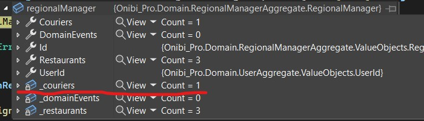

# Project Journal - 2024-01-02

As of yesterday when I went to bed, I realized how comical the solution related to passing collection names to the infrastructure was, just so EF Core could include them.


Therefore, when I woke up, I got to work and came up with a new solution, which involved creating a new repository called `RegionalManagerDomainRepository`. This repository inherits from the generic `DomainRepository`, but in the constructor, I call `.Include(x => x.Couriers)`. After that, I swapped it in Dependency Injection, and everything seemed great. Well, except that it didn't work :').

A change in tactics was necessary. Instead of creating a new repository, I decided to create specifications for specific aggregates (if needed). So, I started by creating an interface for the inclusion specification.

```csharp
internal interface IIncludeSpecification<TAggregateRoot, TId>
    where TAggregateRoot : AggregateRoot<TId>
    where TId : ValueObject
{
    IQueryable<TAggregateRoot> Include(IQueryable<TAggregateRoot> query);
}
```

ISpecificationProvider:

```csharp
internal interface ISpecificationProvider<TAggregateRoot, TId>
    where TAggregateRoot : AggregateRoot<TId>
    where TId : ValueObject
{
    IIncludeSpecification<TAggregateRoot, TId>? GetIncludeSpecification();
}
```

Implementation and registration:

```csharp
internal class RegionalManagerSpecificationProvider : ISpecificationProvider<RegionalManager, RegionalManagerId>
{
    public IIncludeSpecification<RegionalManager, RegionalManagerId>? GetIncludeSpecification()
    {
        return new RegionalManagerWithCouriersSpecification();
    }
}

internal class RegionalManagerWithCouriersSpecification
    : IIncludeSpecification<RegionalManager, RegionalManagerId>
{
    public IQueryable<RegionalManager> Include(IQueryable<RegionalManager> query)
    {
        return query.Include(rm => rm.Couriers);
    }
}

services.AddScoped<ISpecificationProvider<RegionalManager, RegionalManagerId>, RegionalManagerSpecificationProvider>();
```

Thanks to this, I had a service ready to use in the repository. I used it in the `GetByIdAsync` method:

```csharp
public async Task<TAggregateRoot?> GetByIdAsync(TId id, CancellationToken cancellationToken)
{
    IQueryable<TAggregateRoot> query = _dbSet;

    var includeSpecification = _specificationProvider?.GetIncludeSpecification();
    if (includeSpecification != null)
    {
        query = includeSpecification.Include(query);
    }

    return await query.SingleOrDefaultAsync(entity => entity.Id.Equals(id), cancellationToken);
}
```

As you can see, it works!


