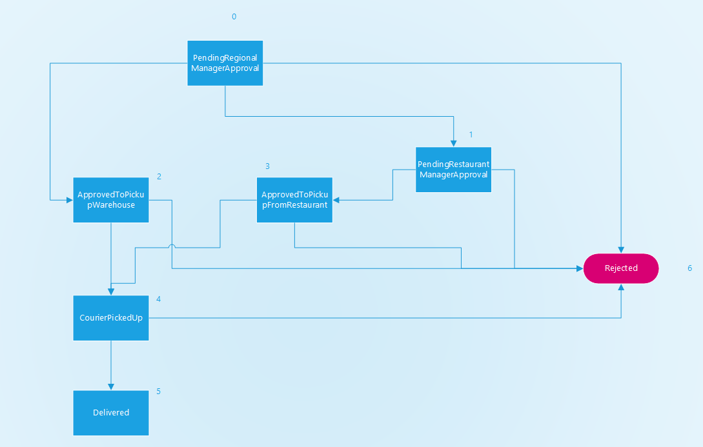

# Project Journal - 2024-01-02

Today, significant progress was made in the shipment module. I am extremely pleased with how it's functioning thus far. It's nice how adding endpoints, a bit of UI logic, and letting the domain handle validation and status changes resulted in a well-encapsulated solution.

Here's how the shipment flow looks currently:

I verified the path with the pickup of a package from a specified address (i.e., not another restaurant) and rejecting the shipment at any point. In this path, only the regional manager can reject the shipment at any time. In the path involving another restaurant, any manager from the originating restaurant can reject the shipment request.

Overall, it's been a fun experience with scanning QR codes and checking paths. I don't want to waste ink on printing, so I take a photo with my phone and then scan the code using the laptop camera. Necessity is the mother of invention, as they say – haha.

I won't write anything more because I cut my finger, and now I'm typing very slowly. Still, I'm very excited about the upcoming days of development.

