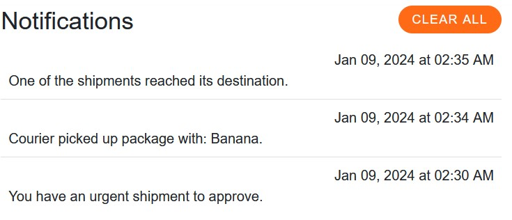

# Project Journal - 2024-01-09

Today, there was a lot of work again. I think I completed things related to messages. But most importantly, the notification microservice finally sends notifications. I mean, I had to change the notification model a bit to make it possible to delete them, but now it's working well.

So, I created a service for sending requests to my internal notification API. In case of failure, the request is retried, with a maximum of 3 attempts. I thought about using a library called Polly, but ultimately opted for the classic approach of using try-catch in a loop. It might look funny, but that's how it's done. I've seen such solutions on the internet and also at commercial work.

```csharp
public async Task SendNotification(Notification notification, CancellationToken cancellationToken = default)
{
    var httpClient = _httpClientFactory.CreateClient(nameof(HttpNotificationService));
    httpClient.BaseAddress = new Uri(_options.BaseUrl);
    var content = new StringContent(JsonConvert.SerializeObject(notification), Encoding.UTF8, "application/json");

    for (int i = 0; i < RetryCount; i++)
    {
        if (cancellationToken.IsCancellationRequested)
        {
            _logger.LogInformation("Notification sending was canceled after attempt: {tryNumber}", i);
            return;
        }

        try
        {
            var response = await httpClient.PostAsync(_options.SendNotificationUrl, content, cancellationToken);

            response.EnsureSuccessStatusCode();

            _logger.LogInformation("Notification sent successfully on attempt: {tryNumber}", i);

            return;
        }
        catch (Exception ex)
        {
            _logger.LogWarning(ex, "Failed to send notification on attempt {tryNumber}", i);
            await Task.Delay(500, cancellationToken);
        }
    }

    throw new RequestFailedException();
}
```

The working principle is very simple: HttpClient tries to send the request three times with a 500ms interval, and if it fails, an exception is thrown, canceling the entire transaction.

Additionally, I finally added domain events with handlers for each status change. They are responsible for sending the appropriate notifications to the respective users. Although I should clarify, they are responsible for providing data, which will then be used to send notifications in the service. The decision about who should receive notifications is, of course, made in the domain, but the domain provides values specific to it, such as RegionalManagerId. The notification service knows nothing about the domain, so event handlers have to fetch userId from the database and then send it further.


I still have one handler left, but I'll leave that for later. For now, the results are very good.



See ya (I wish I had Fumo)


