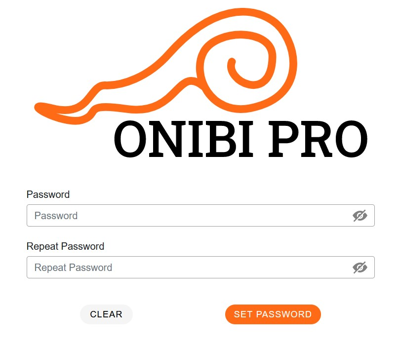

## Project Journal - After the "Break" - 2024-01-24

I'm back after a bit of a break from journaling. A lot has been done, but I don't want to dwell on the details for too long. In a nutshell:

- After creating a user (Regional Manager or Manager), they receive an email with an activation link to their provided email. Encrypted links are stored in Redis in case of any tampering attempts.

  - Email appearance on mail trap:

    

  - Unfortunately, email clients don't handle styles well. In Outlook, it looks like:

    

- After clicking the link, the user is redirected to a page:

  

  which then automatically redirects to:

  

  where the user sets their password. Yaay

  I guess i should finally change visibility of this project on github to public so that sussy bots will clone the repo without any fees.

  
