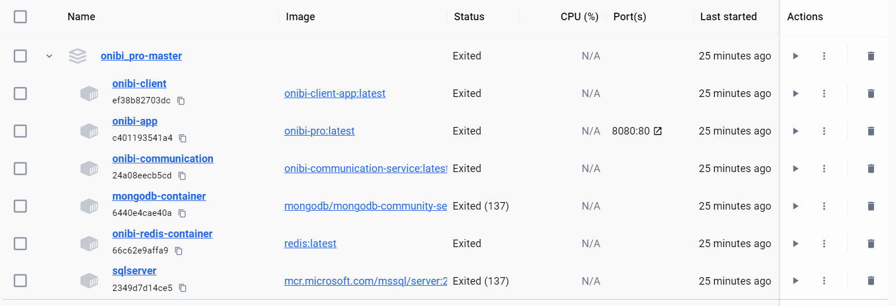

## Project Journal - January 29, 2024

### Mission Accomplished

It can be considered that the development is essentially completed. I see one more thing to fix, but it's a cosmetic change, and I'll probably leave it as it is. I can finally say:

### It works!

I just checked, the application can be run on another computer using simple `docker-compose build` and `docker-compose up` commands. The application also has seed data for the database, including tables, procedures, etc., from development, so it would be appropriate to clean that up. But all in all, the seeding works too.

I am extremely proud of this project, both for how smoothly most things went and for the determination I had to write this application.

I'm not sure if this is the last entry, perhaps I'll write one more. It would be good to create a proper README for the project.

By the way, I bought Touhou 12 today, I'm so happy because of it.

That's it for today.

