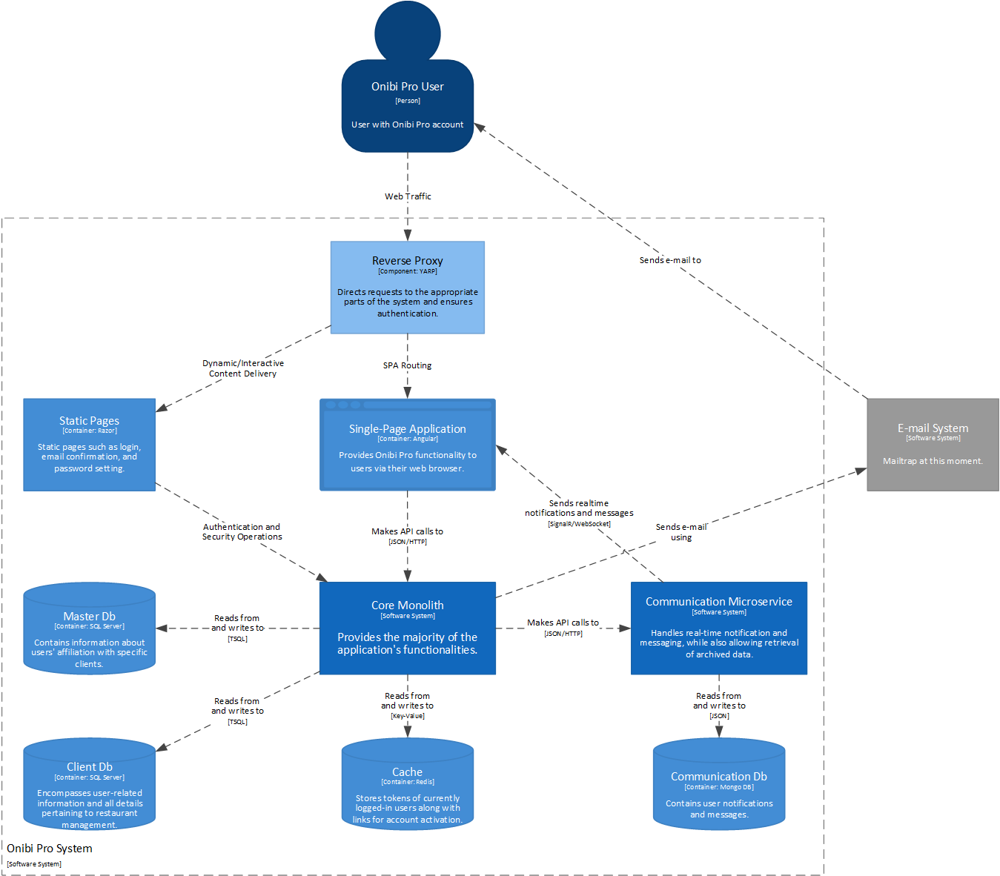

# Onibi Pro - Scalable Fast Food Network Management System

## Project Overview

Onibi Pro is a project based on the principles of Domain-Driven Design, crafted to efficiently and scalably manage a fast-food network. The primary objective is to apply programming practices, such as DDD, tailored to the specific requirements of the gastronomy industry.

## Technologies and Tools:

### Backend:

- Dapper 2.1.28
- MediatR 12.2.0
- EntityFrameworkCore 8.0.1
- ErrorOr 1.9.0
- Mapster 7.4.0
- SignalR 8.0.1
- Yarp.ReverseProxy 2.1.0
- MailKit 4.3.0
- FluentValidation 11.9.0

### Data Storage:

- Redis
- MongoDB
- SQL Server

### Development Stack:

- .NET 8
- Angular 16.2.10

### Tools and IDEs:

- NSwagStudio 14.0.1.0
- Visual Studio 2022
- Visual Studio Code
- Microsoft SQL Server Management Studio 18
- Docker Desktop

## Architecture

User interactions in Onibi Pro kick off with the reverse proxy, a vital guide directing requests to their respective destinations. Whether users head to the main Single Page Application (SPA) for primary functions or to Razor pages for tasks like login, email confirmation, and password setup, the reverse proxy is the orchestrator behind the scenes.  
We have two main players on the backend: the Core Monolith and the Communication Microservice. The Core Monolith handles the heavy lifting, dealing with core operations, domain, and business logic. On the other side, the Communication Microservice steps in for real-time communication with the SPA. It manages notifications and messages between users, providing an API for accessing stored messages. Communication between the monolith and the microservice is like a one-way street, mainly involving the dispatch of domain event information from the monolith that eventually transforms into user notifications.  
Data storage is a mix of relational and non-relational databases. MasterDb links user emails with specific system clients, while each client gets its own ClientDb. Redis plays a temporary storage role for tokens and other transient data. Meanwhile, Mongo DB steps in for the Communication Microservice, holding onto notifications and messages.  
It's worth noting that our email system, though crucial for user communication, operates externally and isn't an intrinsic part of the Onibi Pro system. Its job is to send emails to users when needed.  
This system architecture brings together modular components, providing scalability and manageability for navigating the complexities of a fast-food network. The seamless interaction between the frontend, monolith, microservice, and databases ensures a cohesive and responsive user experience.

## Features:

#### User Roles and Management:

- Manager Role: Assigned to specific restaurants, managers can add orders, employees, set schedules, and order ingredients for dish preparation.
- Regional Manager Role: Has the authority to assign managers to specific restaurants, confirm or reject shipments, and allocate couriers to deliveries.
- Global Manager Role: Holds the power to create new restaurants and assign them to regional managers, and create menus. Additionally, global managers can review various statistics related to restaurants.
- Courier Role: Utilizes the application for scanning package codes and tracking delivery destinations.

#### Restaurant Operations:

- Order Management: Managers can seamlessly add and manage customer orders, streamlining the restaurant's daily operations.
- Employee Management: Managers have the capability to handle employee-related tasks, including scheduling and work assignments.
- Ingredient Ordering: Managers can order necessary ingredients for dish preparation, ensuring a well-stocked kitchen.

#### Hierarchy and Assignment:

- Hierarchical Structure: The system implements a hierarchical structure with managers, regional managers, and global managers overseeing specific levels of operations.
- Assignment Flexibility: Regional managers can assign managers to specific restaurants, and global managers have the authority to create and assign restaurants to regional managers.

#### Shipment and Delivery:

- Shipment Confirmation: Regional managers can confirm or reject shipments, ensuring control over the arrival of essential supplies.
- Courier Assignment: Regional managers can assign couriers to specific deliveries, optimizing the logistics process.

#### Global Insights:

- Statistical Analysis: Global managers have access to comprehensive statistics, allowing them to make informed decisions and monitor the performance of different restaurants.

## Insights and Observations:

The Domain-Driven Design (DDD) approach proved to be appropriate for this application, as it allowed for the simplification of many processes. Although it took more time (especially due to several conceptual changes during development), DDD proved invaluable in certain areas of the application.

I would like to highlight the shipping process, which is quite complex and depends on several factors such as regional manager approval, package receipt, and pickup location. In a feature-driven development approach (i.e., no time, just code), any logic related to shipments would be fragmented into many handlers, where duplication would undoubtedly occur. If the business process changed, the logic would have to be changed everywhere, which is asking for trouble. Not to mention that applying the right principles in the right handlers would be difficult and could evolve into what is commonly referred to as "tribal knowledge".

In my application, all the rules are in the aggregate along with a graph representing valid transitions along with conditions. This solution demonstrates the full potential of DDD.

Another new approach I took in the application is to avoid exceptions and global middleware to catch them and present them to the user. Instead, methods that might fail return an `ErrorOr`, which is a discriminated union that allows an error to be returned when something goes wrong. This can then be handled in a cleaner way than exceptions.
